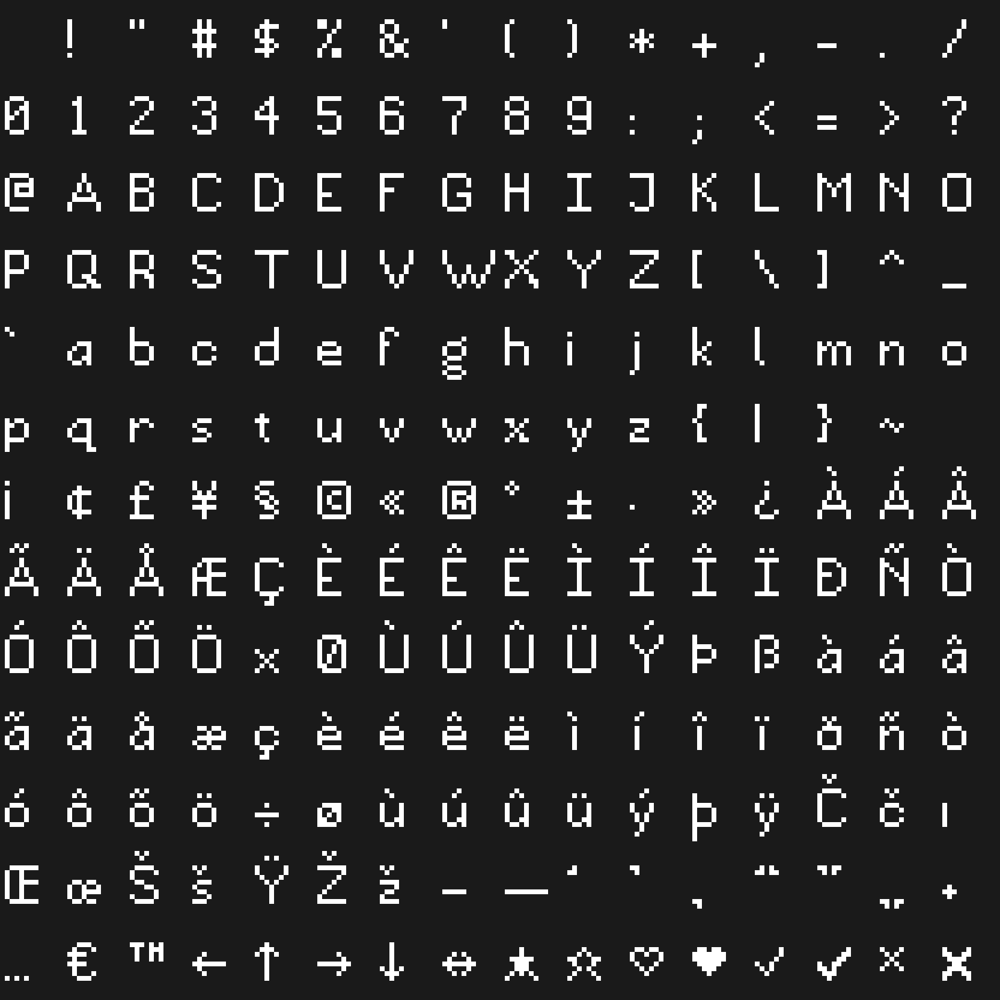

# FalseType

The [Wplace](https://wplace.live) canvas alphabet as a font. Every glyph is whole pixels traced into
rectilinear outlines, so at the right size the browser draws it with no antialiasing at all. The name
is a dig at TrueType.



## Use

Copy `dist/FalseType.woff2` into your site and size it in whole rem:

```css
@font-face {
  font-family: 'FalseType';
  src: url('/fonts/FalseType.woff2') format('woff2');
  font-display: block;
}

.logo {
  font-family: 'FalseType', monospace;
  font-size: 2rem; /* 1rem is 1:1, 2rem 2:1, 3rem 3:1 */
  line-height: 1;
  letter-spacing: 0;
  font-kerning: none;
}
```

One canvas pixel is 64 units of a 1024 unit em. Caps are 8 pixels, x-height 5, descenders 3, and
every letter advances its width plus 1. Ascent and descent fill the em with the baseline 11 pixels
down, so with `line-height: 1` the x-height sits where a typical text face's does and reads level
beside ordinary UI text. At any size that is not a whole multiple of 1rem, or in a browser zoomed to
anything but 100%, the pixels fall off the device grid and blur.

## Charset

Printable ASCII, Latin-1 letters plus Œ œ Š š Ž ž Č č Ÿ, typographic punctuation, `€ £ ¥ ¢`,
arrows `← → ↑ ↓ ↔`, checks `✓ ✔ ✗ ✘`, stars `★ ☆` and hearts `♥ ♡`. No kerning table yet.

## Edit

The letters A to Z and a to z are copied from the canvas. Everything else lives as text bitmaps in
`glyphs/extra-glyphs.mjs`:

- `EXTRA_GLYPHS` are drawn glyphs, rows top to bottom in an 11 row frame that starts at the cap top,
  `#` for ink.
- `COMPOSED` builds accented letters from a base letter and a mark in `MARKS`. A bitmap in
  `EXTRA_GLYPHS` for the same character wins, which is how you override a composed shape.

Then rebuild:

```sh
npm install
npm run build
```

`build:sheet` rewrites `glyphs/sheet.png` and `sheet.json` in code point order and the preview above.
`build:font` traces the sheet into `dist/FalseType.otf` and `.woff2`. To change a letter from the
canvas, edit `glyphs/sheet.png` directly at 1:1 and run `build:font` only.

## License

[SIL Open Font License 1.1](LICENSE). The letterforms are Wplace's canvas alphabet.
